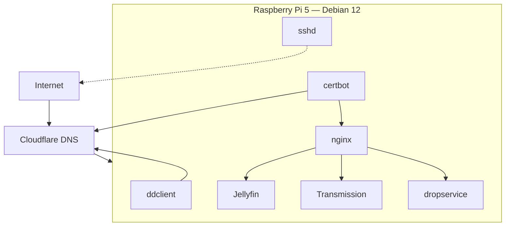

# homelab

My homelab config docs and some config files, because if I don't put em somewhere I
might forget...

Raspberry Pi 5, Debian 12 (bookworm), sat behind a home router on a dynamic IP,
publicly reachable as subdomains of `sillyash.com` (Cloudflare-managed DNS).

## Overview



Each service's own README below has a more detailed diagram — this one is just the
map of how they fit together.

## Services

| Service | What | Docs |
|---|---|---|
| nginx | Reverse proxy + TLS termination for every HTTPS host | [services/nginx](services/nginx/README.md) |
| certbot | Let's Encrypt certs via Cloudflare DNS-01 challenge | [services/certbot](services/certbot/README.md) |
| ddclient | Keeps Cloudflare DNS pointed at this box's dynamic public IP | [services/ddclient](services/ddclient/README.md) |
| Jellyfin | Media server, `jelly.sillyash.com` | [services/jellyfin](services/jellyfin/README.md) |
| Transmission | BitTorrent client, `transmission.sillyash.com` | [services/transmission](services/transmission/README.md) |
| dropservice | Custom password-gated Flask file-upload service, `drop.sillyash.com` — own repo, included as a submodule | [services/dropservice](services/dropservice) |
| SSH | Remote shell access, `ssh.sillyash.com:22` (direct, not nginx-proxied) | [services/ssh](services/ssh/README.md) |
| fail2ban | Bans IPs after repeated failed SSH/Transmission-login attempts | [services/fail2ban](services/fail2ban/README.md) |

Config snippets and systemd units in this repo are the real files from the running
box, with all secrets (API tokens, passwords) redacted or replaced by `.example`
templates — nothing here is committed as-is without checking for sensitive values
first.

## Quick command reference

Restart / status / logs for each systemd-managed service. See each service's own
README for config testing, cert renewal, torrent CLI, fail2ban ban/unban, etc.

| Service | Restart | Status | Logs |
|---|---|---|---|
| [nginx](services/nginx/README.md) | `sudo systemctl reload nginx` | `systemctl status nginx` | `sudo tail -f /var/log/nginx/access.log` |
| [certbot](services/certbot/README.md) | n/a — timer-driven | `systemctl status certbot.timer` | `journalctl -u certbot -n 50` |
| [ddclient](services/ddclient/README.md) | `sudo systemctl restart ddclient` | `systemctl status ddclient` | `journalctl -u ddclient -n 50` |
| [Jellyfin](services/jellyfin/README.md) | `sudo systemctl restart jellyfin` | `systemctl status jellyfin` | `journalctl -u jellyfin -f` |
| [Transmission](services/transmission/README.md) | `sudo systemctl restart transmission-daemon` | `systemctl status transmission-daemon` | `journalctl -u transmission-daemon -n 50` |
| [dropservice](services/systemd/README.md) | `sudo systemctl restart drop` | `systemctl status drop` | `journalctl -u drop -f` |
| [SSH](services/ssh/README.md) | `sudo systemctl reload ssh` | `systemctl status ssh` | `journalctl -u ssh -n 50` |
| [fail2ban](services/fail2ban/README.md) | `sudo systemctl restart fail2ban` | `fail2ban-client status` | `journalctl -u fail2ban -n 50` |

Prefer `reload` over `restart` where shown — it re-reads config without dropping
active connections/sessions.

## Cloning

`dropservice` is a git submodule:

```bash
git clone --recurse-submodules git@github.com:sillyash/homelab.git
# or, after a normal clone:
git submodule update --init
```
