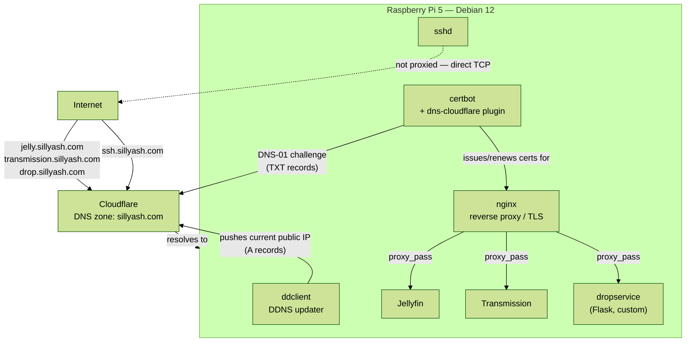

# homelab

My homelab config docs and some config files, because if I don't put em somewhere I
might forget...

Raspberry Pi 5, Debian 12 (bookworm), sat behind a home router on a dynamic IP,
publicly reachable as subdomains of `sillyash.com` (Cloudflare-managed DNS).

## Overview



## Services

| Service | What | Docs |
|---|---|---|
| nginx | Reverse proxy + TLS termination for every HTTPS host | [services/nginx](services/nginx/README.md) |
| certbot | Let's Encrypt certs via Cloudflare DNS-01 challenge | [services/certbot](services/certbot/README.md) |
| ddclient | Keeps Cloudflare DNS pointed at this box's dynamic public IP | [services/ddclient](services/ddclient/README.md) |
| Jellyfin | Media server, `jelly.sillyash.com` | [services/jellyfin](services/jellyfin/README.md) |
| Transmission | BitTorrent client, `transmission.sillyash.com` | [services/transmission](services/transmission/README.md) |
| dropservice | Custom password-gated Flask file-upload service, `drop.sillyash.com` — own repo, included as a submodule | [services/dropservice](services/dropservice) |
| SSH | Remote shell access, `ssh.sillyash.com:22` (direct, not nginx-proxied) | [services/ssh](services/ssh/README.md) |

Config snippets and systemd units in this repo are the real files from the running
box, with all secrets (API tokens, passwords) redacted or replaced by `.example`
templates — nothing here is committed as-is without checking for sensitive values
first.

## Cloning

`dropservice` is a git submodule:

```bash
git clone --recurse-submodules git@github.com:sillyash/homelab.git
# or, after a normal clone:
git submodule update --init
```
