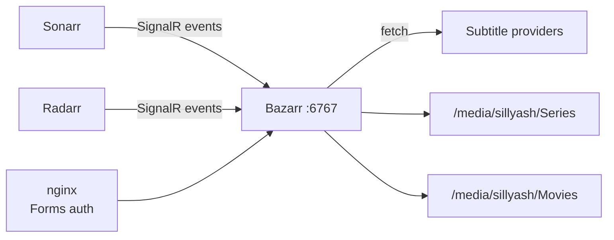

# Bazarr

Subtitle manager for [Sonarr](../sonarr/README.md) and [Radarr](../radarr/README.md)
libraries — watches both via their SignalR feeds and downloads missing/better
subtitles as new episodes/movies are imported. Reachable at
`https://bazarr.sillyash.com` via the [nginx](../nginx/README.md) reverse proxy
(nginx handles TLS; Bazarr itself listens on plain HTTP on `6767`).

## Architecture



## Install

No apt/official installer package — deployed from source into a Python venv, since
that's Bazarr's supported install method on Debian.

```bash
sudo git clone https://github.com/morpheus65535/bazarr.git /opt/bazarr
cd /opt/bazarr
sudo python3 -m venv venv
sudo ./venv/bin/pip install -r requirements.txt
```

Runs as a dedicated `bazarr` user, in the shared `media` group (gid 1001).

`/etc/systemd/system/bazarr.service` (custom unit — nothing ships one):

```ini
[Unit]
Description=Bazarr Daemon
After=network.target sonarr.service radarr.service

[Service]
User=bazarr
Group=media
UMask=0002
Type=simple
WorkingDirectory=/opt/bazarr
ExecStart=/opt/bazarr/venv/bin/python3 /opt/bazarr/bazarr.py --config /var/lib/bazarr --no-update
TimeoutStopSec=20
Restart=on-failure

[Install]
WantedBy=multi-user.target
```

`After=sonarr.service radarr.service` so it comes up once both are already
listening, since it connects out to them on start.

## Config

Config lives at `/var/lib/bazarr/config/config.yaml` (not committed — contains API
keys and an MD5 password hash).

- **Sonarr/Radarr connections**: `general.use_sonarr` / `general.use_radarr` both
  `true`, pointed at `127.0.0.1:8989` / `127.0.0.1:7878` using each app's API key.
  Confirmed live via `journalctl -u bazarr` showing both SignalR clients connected.
- **Authentication**: differs from Sonarr/Radarr/Prowlarr in two ways worth knowing
  if scripting against it — auth type is set via `type: form` in config.yaml
  (not a `authenticationRequired` field), and its REST API uses an `X-API-KEY`
  header (all caps), not `X-Api-Key` like the ASP.NET-based *arr apps. Username
  `ashley`; generated password in `/root/.arr-api-keys` on the Pi.
- Its settings-save endpoint (`POST /api/system/settings`) takes a
  **form-urlencoded** body with dynaconf-flattened keys (`settings-<section>-<key>`,
  e.g. `settings-general-use_sonarr`), not JSON — sending JSON silently no-ops
  (`204` with nothing actually saved). Booleans must be the literal lowercase
  strings `true`/`false`; anything else (including Python-style `True`) fails a type
  validator.

## Useful commands

```bash
sudo systemctl restart bazarr
systemctl status bazarr
journalctl -u bazarr -n 100 --no-pager
journalctl -u bazarr -f                     # watch SignalR connections / subtitle grabs live

# API (X-API-KEY header — all caps, unlike the other *arr apps)
curl -s http://localhost:6767/api/system/status -H "X-API-KEY: $BAZARR_KEY"
```
