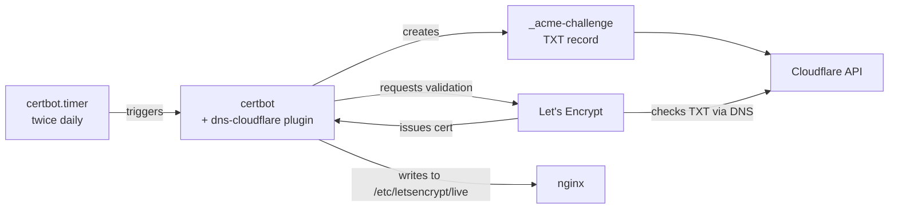

# certbot

Issues and renews Let's Encrypt certificates using the **Cloudflare DNS-01
challenge** (`python3-certbot-dns-cloudflare` plugin) instead of the HTTP-01
challenge. DNS-01 is used because the box is on a residential connection behind a
dynamic IP ([ddclient](../ddclient/README.md) keeps DNS pointed at it) — proving
domain ownership via a DNS TXT record is simpler and more reliable than depending on
inbound port 80 always reaching this exact machine.

## Architecture



## Install

```bash
apt install certbot python3-certbot-dns-cloudflare
```

## Credentials

Certbot's Cloudflare plugin reads an API token from a credentials file (never
committed — see [`cloudflare.ini.example`](cloudflare.ini.example)):

```bash
install -m 600 /dev/null /etc/letsencrypt/cloudflare.ini
# then fill in dns_cloudflare_api_token = <token>
```

The token needs only **Zone → DNS → Edit**, scoped to the `sillyash.com` zone.

## Issuing a cert

```bash
certbot certonly \
  --dns-cloudflare \
  --dns-cloudflare-credentials /etc/letsencrypt/cloudflare.ini \
  -d sub.sillyash.com \
  --non-interactive --agree-tos --email admin@sillyash.com
```

## Renewal

Handled automatically by the `certbot.timer` systemd timer that ships with the
package — runs twice daily (`00:00` / `12:00`, with randomized delay), calling
`certbot renew` which only actually renews certs within 30 days of expiry.

```bash
systemctl status certbot.timer
```

## Current certificates

- `drop.sillyash.com` — used by [dropservice](../dropservice/README.md)
- `jelly.sillyash.com` (covers `jelly.sillyash.com` + `transmission.sillyash.com` as
  SANs) — used by [Jellyfin](../jellyfin/README.md) and
  [Transmission](../transmission/README.md)

## Useful commands

```bash
sudo certbot certificates                  # list all certs + expiry dates
sudo certbot renew --dry-run               # test the renewal flow without touching real certs
sudo certbot renew                         # force renewal attempt now (normally left to the timer)
sudo certbot certonly --dns-cloudflare \
  --dns-cloudflare-credentials /etc/letsencrypt/cloudflare.ini \
  -d new.sillyash.com                      # issue a cert for a new subdomain
sudo certbot delete --cert-name <name>     # remove a cert no longer needed

systemctl status certbot.timer             # confirm the renewal timer is active
systemctl list-timers certbot.timer        # see next scheduled run
journalctl -u certbot -n 50 --no-pager     # last renewal attempt's output
```

**No renewal deploy-hook is configured** (`/etc/letsencrypt/renewal-hooks/deploy/` is
empty) — nginx loads certs into memory at startup/reload and won't notice a renewed
file on disk by itself. After any renewal, reload nginx manually so it picks up the
new cert:

```bash
sudo nginx -t && sudo systemctl reload nginx
```

Worth revisiting: dropping a script into `renewal-hooks/deploy/` that runs
`nginx -t && systemctl reload nginx` would make this automatic.
