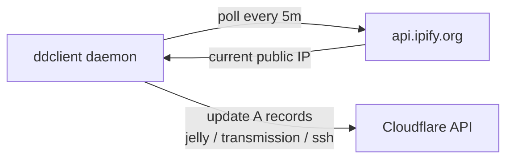

# ddclient

Keeps Cloudflare DNS pointed at the box's current public IP, since it's on a
residential (dynamic IP) connection.

## Architecture



## Install

```bash
apt install ddclient
```

## How it works

- Polls `https://api.ipify.org/` to learn the current public IP (`use=web`).
- Runs as a daemon (`daemon_interval=5m` in the systemd unit's environment) and pushes
  updates via the Cloudflare API (`protocol=cloudflare`) whenever the IP changes.
- Updates **A records** for `jelly`, `transmission`, and `ssh` under the
  `sillyash.com` zone in one pass (dropservice's `drop` record is not in the list —
  see note below).
- `ttl=1` — Cloudflare treats `1` as "Automatic" TTL.

## Config

Real file with the token redacted: [`ddclient.conf.example`](ddclient.conf.example).
Deploy as `/etc/ddclient.conf` (mode `600`) with a real Cloudflare API token
(**Zone → DNS → Edit**, scoped to the `sillyash.com` zone — same scope as the
[certbot](../certbot/README.md) token, can reuse the same token or use a separate one).

```ini
protocol=cloudflare
zone=sillyash.com
ttl=1
login=token
password=<your-cloudflare-api-token>
jelly.sillyash.com,transmission.sillyash.com,ssh.sillyash.com
```

## systemd

Stock unit shipped by the `ddclient` package (`/lib/systemd/system/ddclient.service`)
— no local overrides. Enable with:

```bash
systemctl enable --now ddclient
```

## Useful commands

```bash
sudo systemctl restart ddclient            # apply a ddclient.conf change
systemctl status ddclient                  # running? last update result?
sudo ddclient -daemon 0 -verbose -noquiet  # force a single foreground update run, verbose (for debugging)
sudo ddclient -query                       # check what IP ddclient last determined, without updating
journalctl -u ddclient -n 50 --no-pager    # recent update history
```
