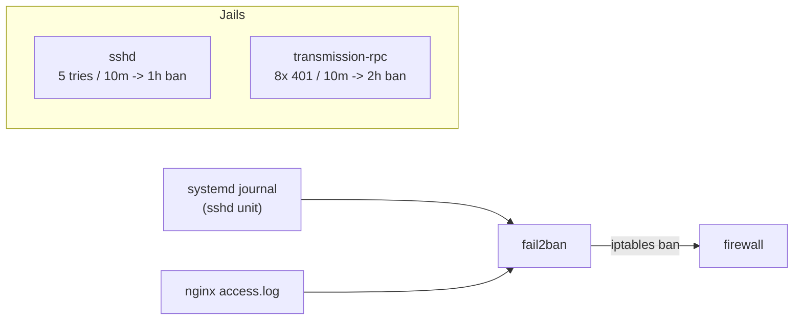

# fail2ban

Bans IPs at the firewall after repeated failed attempts against a service, watching
log files/journald for failure patterns. Shared infrastructure for two jails on this
box: [SSH](../ssh/README.md) and [Transmission's public RPC](../transmission/README.md).

## Architecture



## Install

```bash
apt install fail2ban
systemctl enable --now fail2ban
```

## Config

- [`jail.local`](jail.local) → `/etc/fail2ban/jail.local` — enables both jails.
- [`transmission-rpc.filter.conf`](transmission-rpc.filter.conf) →
  `/etc/fail2ban/filter.d/transmission-rpc.conf` — custom filter matching HTTP 401s
  in nginx's shared access log. (401 is effectively unique to Transmission's RPC
  among this box's vhosts — Jellyfin and dropservice don't return 401, so no
  per-vhost log split was needed.)

The `sshd` jail uses fail2ban's built-in filter (`backend = systemd`, reads the
`sshd` unit's journal entries directly — no log file needed).

## Useful commands

```bash
fail2ban-client status                       # list active jails
fail2ban-client status sshd                  # jail detail: failed/banned counts, banned IPs
fail2ban-client status transmission-rpc
fail2ban-client set sshd unbanip <IP>        # manually unban
fail2ban-client set sshd banip <IP>          # manually ban
fail2ban-regex <logfile> <filter.conf>       # dry-run a filter against a log before enabling it
systemctl restart fail2ban                   # reload jail.local / filter changes
journalctl -u fail2ban -n 50 --no-pager      # fail2ban's own log
```
