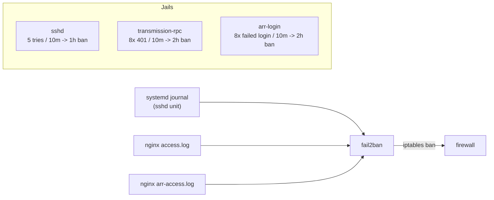

# fail2ban

Bans IPs at the firewall after repeated failed attempts against a service, watching
log files/journald for failure patterns. Shared infrastructure for three jails on
this box: [SSH](../ssh/README.md), [Transmission's public RPC](../transmission/README.md)
(also covers [Jellyseerr](../jellyseerr/README.md) — see below), and the
[arr-stack](../sonarr/README.md) apps' web logins.

## Architecture


```mermaid
graph LR
    journal["systemd journal<br>(sshd unit)"] --> f2b["fail2ban"]
    nginxlog["nginx access.log"] --> f2b
    arrlog["nginx arr-access.log"] --> f2b
    f2b -->|"iptables ban"| firewall["firewall"]

    subgraph Jails
        sshd_jail["sshd<br>5 tries / 10m -> 1h ban"]
        rpc_jail["transmission-rpc<br>8x 401 / 10m -> 2h ban"]
        arr_jail["arr-login<br>8x failed login / 10m -> 2h ban"]
    end
```

## Install

```bash
apt install fail2ban
systemctl enable --now fail2ban
```

## Config

- [`jail.local`](jail.local) → `/etc/fail2ban/jail.local` — enables all three jails.
- [`transmission-rpc.filter.conf`](transmission-rpc.filter.conf) →
  `/etc/fail2ban/filter.d/transmission-rpc.conf` — custom filter matching HTTP 401s
  in nginx's shared access log. Originally written for Transmission's RPC prompt;
  since [Jellyseerr](../jellyseerr/README.md) also answers a failed login with a
  plain 401, this same filter/jail covers it too with no changes needed — the name
  is now slightly stale (it's really "401s across the shared vhosts", not
  Transmission-specific), worth a rename if it gets confusing.
- [`arr-login.filter.conf`](arr-login.filter.conf) →
  `/etc/fail2ban/filter.d/arr-login.conf` — a *separate* filter for Sonarr, Radarr,
  and Prowlarr, which (unlike Transmission/Jellyseerr) answer a failed login with a
  **302 redirect** to `/login?...&loginFailed=true`, not a 401 — so the generic 401
  filter can't see them. Reads a dedicated `/var/log/nginx/arr-access.log` written
  with the `arr_auth` format ([`services/nginx/conf.d/log-formats.conf`](../nginx/conf.d/log-formats.conf))
  that captures the response's `Location` header. Also matches Bazarr's failed
  login, which *does* return a plain 403 on `POST /api/system/account` — folded
  into the same filter/jail rather than a fourth one, since it's the same "arr-stack
  login" concern.

The `sshd` jail uses fail2ban's built-in filter (`backend = systemd`, reads the
`sshd` unit's journal entries directly — no log file needed).

## Useful commands

```bash
fail2ban-client status                       # list active jails
fail2ban-client status sshd                  # jail detail: failed/banned counts, banned IPs
fail2ban-client status transmission-rpc
fail2ban-client status arr-login
fail2ban-client set sshd unbanip <IP>        # manually unban
fail2ban-client set sshd banip <IP>          # manually ban
fail2ban-regex <logfile> <filter.conf>       # dry-run a filter against a log before enabling it
systemctl restart fail2ban                   # reload jail.local / filter changes
journalctl -u fail2ban -n 50 --no-pager      # fail2ban's own log
```
