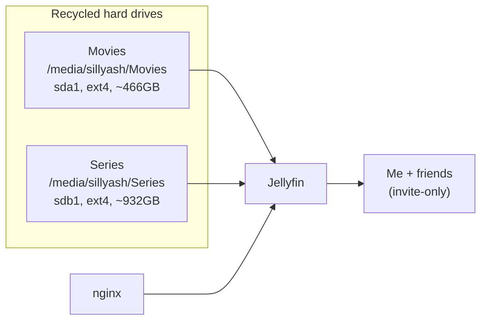

# Jellyfin

Media server, reachable at `https://jelly.sillyash.com` via the
[nginx](../nginx/README.md) reverse proxy (nginx handles TLS; Jellyfin itself listens
on plain HTTP on `8096`, bound to localhost only from the outside world's perspective).

Strictly private — there's no public sign-up. It's just for me and a handful of
friends I've invited directly; access isn't intended to scale beyond that.

## Architecture



The two libraries each live on their own repurposed consumer hard drive (not
enterprise/NAS-grade, no RAID or redundancy between them) — one for movies, one for
shows. Both are auto-mounted at `/media/sillyash/*` via udisks2 rather than an
`/etc/fstab` entry, which means they depend on the desktop session / auto-mount
running rather than a guaranteed boot-time mount — worth knowing if Jellyfin ever
comes up with an empty library after a reboot.

## Install

Installed from the [official Jellyfin apt repo](https://jellyfin.org/docs/general/installation/linux/)
(`apt install jellyfin`), which also pulls in `jellyfin-web` and `jellyfin-ffmpeg`.

## Layout

Stock paths from `/etc/default/jellyfin`, unmodified:

| Path | Purpose |
|---|---|
| `/etc/jellyfin` | config |
| `/var/lib/jellyfin` | data (metadata, plugins, library DB) |
| `/var/log/jellyfin` | logs |
| `/var/cache/jellyfin` | cache/transcoding |

## systemd

Stock unit (`/lib/systemd/system/jellyfin.service`), runs as the dedicated
`jellyfin` user/group. No overrides in `jellyfin.service.d/` — the drop-in that ships
with the package is left fully commented out.

```bash
systemctl enable --now jellyfin
```
