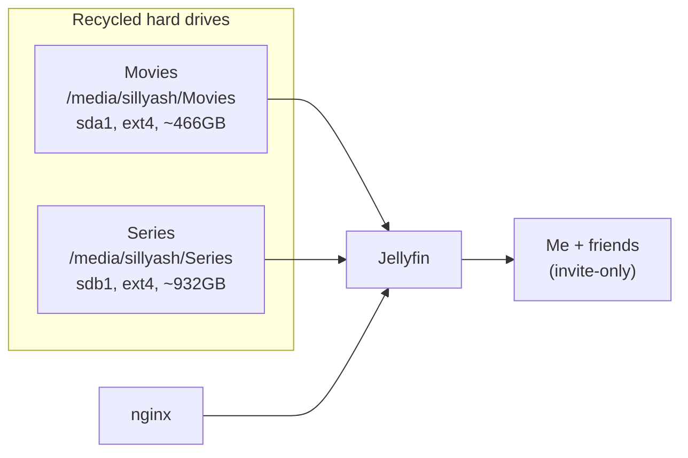

# Jellyfin

Media server, reachable at `https://jelly.sillyash.com` via the
[nginx](../nginx/README.md) reverse proxy (nginx handles TLS; Jellyfin itself listens
on plain HTTP on `8096`, bound to localhost only from the outside world's perspective).

Strictly private — there's no public sign-up. It's just for me and a handful of
friends I've invited directly; access isn't intended to scale beyond that.

## Architecture


```mermaid
graph LR
    subgraph Storage["Recycled hard drives"]
        movies["Movies<br>/media/sillyash/Movies<br>sda1, ext4, ~466GB"]
        series["Series<br>/media/sillyash/Series<br>sdb1, ext4, ~932GB"]
    end

    jellyfin["Jellyfin"]
    nginx["nginx"]
    users["Me + friends<br>(invite-only)"]

    movies --> jellyfin
    series --> jellyfin
    nginx --> jellyfin
    jellyfin --> users
```

The two libraries each live on their own repurposed consumer hard drive (not
enterprise/NAS-grade, no RAID or redundancy between them) — one for movies, one for
shows. Both are auto-mounted at `/media/sillyash/*` via udisks2 rather than an
`/etc/fstab` entry, which means they depend on the desktop session / auto-mount
running rather than a guaranteed boot-time mount — worth knowing if Jellyfin ever
comes up with an empty library after a reboot.

## Install

Installed from the [official Jellyfin apt repo](https://jellyfin.org/docs/general/installation/linux/)
(`apt install jellyfin`), which also pulls in `jellyfin-web` and `jellyfin-ffmpeg`.

## Layout

Stock paths from `/etc/default/jellyfin`, unmodified:

| Path | Purpose |
|---|---|
| `/etc/jellyfin` | config |
| `/var/lib/jellyfin` | data (metadata, plugins, library DB) |
| `/var/log/jellyfin` | logs |
| `/var/cache/jellyfin` | cache/transcoding |

## Excluding staging folders from scans

Both libraries are pointed at their root folders directly (`/media/sillyash/Movies`,
`/media/sillyash/Series`), so any download-client staging dir living under those
roots gets scanned as if it were media otherwise — picking up partial/in-progress
files as junk library entries. Jellyfin 10.11+ supports a native `.ignore` marker:
an empty `.ignore` file dropped in a directory excludes that directory (and
everything under it) from future scans; requires a library rescan
(`POST /Library/Refresh`) to take effect after adding one.

Currently excluded this way:

| Path | Belongs to |
|---|---|
| `/media/sillyash/Movies/_incoming` | Transmission staging ([sonarr](../sonarr/README.md)/[radarr](../radarr/README.md) import dir) |
| `/media/sillyash/Series/_incoming` | Transmission staging |
| `/media/sillyash/Series/_nzbget-tmp` | NZBGet's `MainDir` — see [nzbget](../nzbget/README.md) |

If a new staging/working dir ever gets added under either root (e.g. a
Movies-side NZBGet dir), drop a `.ignore` file in it too rather than letting
Jellyfin scan it.

## systemd

Stock unit (`/lib/systemd/system/jellyfin.service`), runs as the dedicated
`jellyfin` user/group. No overrides in `jellyfin.service.d/` — the drop-in that ships
with the package is left fully commented out.

```bash
systemctl enable --now jellyfin
```

## Useful commands

```bash
sudo systemctl restart jellyfin            # apply a config change (Jellyfin doesn't hot-reload most settings)
systemctl status jellyfin                  # running?
journalctl -u jellyfin -n 100 --no-pager   # recent logs
journalctl -u jellyfin -f                  # follow logs live (e.g. while debugging a transcode)
df -h /media/sillyash/Movies /media/sillyash/Series   # confirm both drives are actually mounted
```

Most day-to-day admin (adding libraries, users, scan-for-new-media) is done through
the web UI at `https://jelly.sillyash.com/web/#/dashboard` rather than the CLI.
