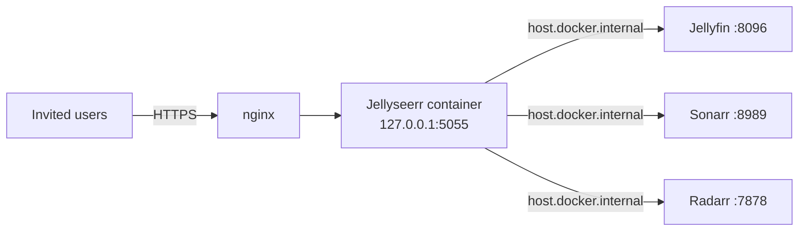

# Jellyseerr

Request/discovery front-end for [Jellyfin](../jellyfin/README.md) — lets invited
users browse and request movies/shows without touching Sonarr/Radarr directly;
requests flow through to [Sonarr](../sonarr/README.md)/[Radarr](../radarr/README.md)
automatically. Reachable at `https://jellyseerr.sillyash.com` via the
[nginx](../nginx/README.md) reverse proxy.

**The one intentional exception to this box's bare-metal/systemd convention** — runs
as a Docker container rather than an apt package, scoped to just this one service
(Docker itself was already installed on the box, undocumented, before this).

## Architecture



## Install

```bash
sudo docker pull fallenbagel/jellyseerr:latest
sudo mkdir -p /var/lib/jellyseerr

sudo docker run -d \
  --name jellyseerr \
  --restart unless-stopped \
  --add-host=host.docker.internal:host-gateway \
  -e LOG_LEVEL=info \
  -e TZ=Europe/Paris \
  -p 127.0.0.1:5055:5055 \
  -v /var/lib/jellyseerr:/app/config \
  fallenbagel/jellyseerr:latest
```

Notes on the flags:

- `-p 127.0.0.1:5055:5055` — bound to localhost only, same exposure model as every
  other service here; nginx is the only public path in.
- `--add-host=host.docker.internal:host-gateway` — **required**. The container has
  its own network namespace, so `127.0.0.1` inside it refers to the container
  itself, not the host — Jellyseerr can't reach Jellyfin/Sonarr/Radarr (which all
  listen on the host's `127.0.0.1`/`0.0.0.0`) without this. Use
  `host.docker.internal` as the hostname when configuring Jellyfin/Sonarr/Radarr
  connections in the setup wizard, not `127.0.0.1` or `localhost`.
- `-v /var/lib/jellyseerr:/app/config` — persists config/database outside the
  container so `docker rm`/recreate doesn't lose it.

## Setup

The image ships no config API for the very first step — initial admin creation is
an interactive "sign in with your Jellyfin account" flow (Jellyseerr proxies the
login to Jellyfin itself to bootstrap the admin user), which needs a real account
password typed into the browser, not scripted:

1. Visit `https://jellyseerr.sillyash.com`, sign in with a Jellyfin account
   (hostname `host.docker.internal`, port `8096`).
2. Add Sonarr and Radarr as services in the setup wizard — hostname
   `host.docker.internal`, ports `8989`/`7878`, API keys from
   `/root/.arr-api-keys` on the Pi.

After initial setup, Jellyseerr's own REST API (`/api/v1/...`, `X-Api-Key` header,
key visible in its own Settings → General page) can be used for anything further.

## Useful commands

```bash
sudo docker ps --filter name=jellyseerr             # running?
sudo docker logs jellyseerr -f                       # follow logs live
sudo docker restart jellyseerr                       # apply an env/flag change (recreate if flags changed)
sudo docker exec jellyseerr wget -qO- http://host.docker.internal:8096/health  # connectivity check to Jellyfin
```
