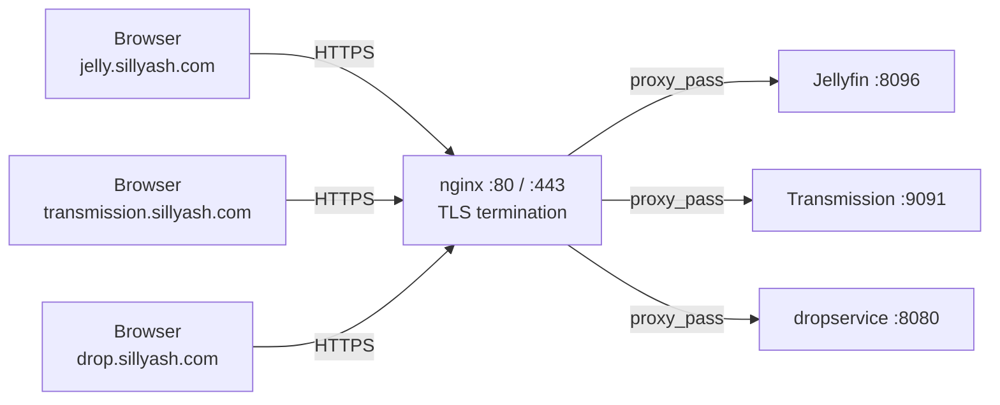

# nginx

Single reverse proxy / TLS termination point for every HTTPS service on the box.
Installed from the Debian repos (`apt install nginx`), config lives under
`/etc/nginx/`. Each virtual host is a file in `sites-available/`, symlinked into
`sites-enabled/`.

## Vhosts

| Host | Symlink name | Proxies to | Cert |
|---|---|---|---|
| `drop.sillyash.com` | `drop` | `127.0.0.1:8080` (dropservice) | `drop.sillyash.com` |
| `jelly.sillyash.com` | `jellyfin` | `localhost:8096` (Jellyfin) | `jelly.sillyash.com` |
| `transmission.sillyash.com` | `jellyfin` (same file, second `server{}` block) | `localhost:9091` (Transmission) | `jelly.sillyash.com` |

All three terminate TLS with certs from [certbot](../certbot/README.md) and redirect
plain HTTP (port 80) to HTTPS. `default` (Debian's stock `sites-available/default`)
stays enabled as the catch-all for requests that don't match a `server_name`.

## Architecture

## Files in this repo

- [`sites-available/drop`](sites-available/drop) — real vhost for dropservice.
- [`sites-available/jellyfin`](sites-available/jellyfin) — real vhost for both
  Jellyfin and Transmission (they share the same Let's Encrypt cert since it covers
  both hostnames as SANs).

To deploy: copy into `/etc/nginx/sites-available/`, symlink into `sites-enabled/`,
then `nginx -t && systemctl reload nginx`.
