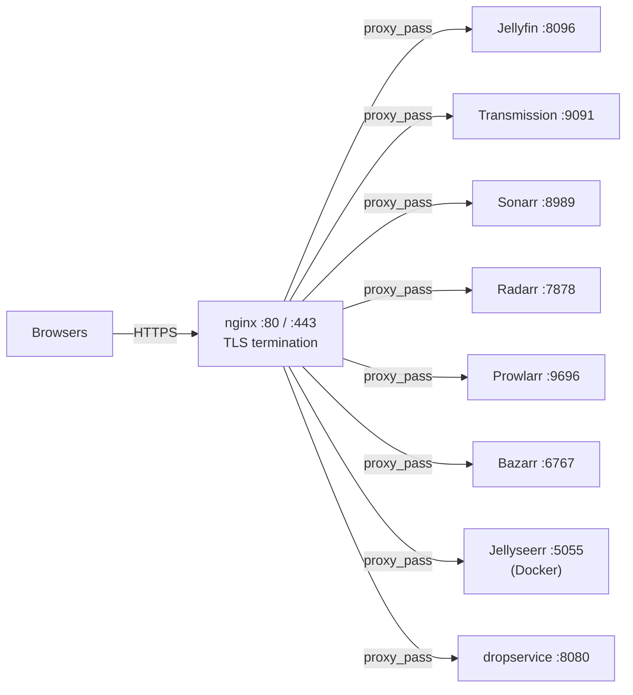

# nginx

Single reverse proxy / TLS termination point for every HTTPS service on the box.
Installed from the Debian repos (`apt install nginx`), config lives under
`/etc/nginx/`. Each virtual host is a file in `sites-available/`, symlinked into
`sites-enabled/`.

## Vhosts

| Host | Symlink name | Proxies to | Cert |
|---|---|---|---|
| `drop.sillyash.com` | `drop` | `127.0.0.1:8080` (dropservice) | `drop.sillyash.com` |
| `jelly.sillyash.com` | `jellyfin` | `localhost:8096` (Jellyfin) | `jelly.sillyash.com` |
| `transmission.sillyash.com` | `jellyfin` (same file, second `server{}` block) | `localhost:9091` (Transmission) | `jelly.sillyash.com` |
| `sonarr.sillyash.com` | `arr-stack` | `localhost:8989` (Sonarr) | `jelly.sillyash.com` |
| `radarr.sillyash.com` | `arr-stack` (same file) | `localhost:7878` (Radarr) | `jelly.sillyash.com` |
| `prowlarr.sillyash.com` | `arr-stack` (same file) | `localhost:9696` (Prowlarr) | `jelly.sillyash.com` |
| `bazarr.sillyash.com` | `arr-stack` (same file) | `localhost:6767` (Bazarr) | `jelly.sillyash.com` |
| `jellyseerr.sillyash.com` | `jellyseerr` | `127.0.0.1:5055` (Jellyseerr, Docker) | `jelly.sillyash.com` |

All terminate TLS with certs from [certbot](../certbot/README.md) and redirect plain
HTTP (port 80) to HTTPS. The `jelly.sillyash.com` cert now covers all of the above as
SANs (one cert, one renewal, one nginx reload). `default` (Debian's stock
`sites-available/default`) stays enabled as the catch-all for requests that don't
match a `server_name`.

## Architecture


```mermaid
graph LR
    clients["Browsers"]

    nginx["nginx :80 / :443<br>TLS termination"]
    jellyfin["Jellyfin :8096"]
    transmission["Transmission :9091"]
    sonarr["Sonarr :8989"]
    radarr["Radarr :7878"]
    prowlarr["Prowlarr :9696"]
    bazarr["Bazarr :6767"]
    jellyseerr["Jellyseerr :5055<br>(Docker)"]
    dropservice["dropservice :8080"]

    clients -->|HTTPS| nginx
    nginx -->|proxy_pass| jellyfin
    nginx -->|proxy_pass| transmission
    nginx -->|proxy_pass| sonarr
    nginx -->|proxy_pass| radarr
    nginx -->|proxy_pass| prowlarr
    nginx -->|proxy_pass| bazarr
    nginx -->|proxy_pass| jellyseerr
    nginx -->|proxy_pass| dropservice
```

## Files in this repo

- [`sites-available/drop`](sites-available/drop) — real vhost for dropservice.
- [`sites-available/jellyfin`](sites-available/jellyfin) — real vhost for both
  Jellyfin and Transmission (they share the same Let's Encrypt cert since it covers
  both hostnames as SANs). The Transmission `server{}` block also applies rate
  limiting — see below.
- [`sites-available/arr-stack`](sites-available/arr-stack) — real vhost for
  Sonarr, Radarr, Prowlarr, and Bazarr (one file, four `server{}` blocks). Each
  app's `/login` (or, for Bazarr, `/api/system/account`) path gets nginx rate
  limiting, and the whole vhost logs to a separate
  `/var/log/nginx/arr-access.log` using a custom format (see
  [`conf.d/log-formats.conf`](conf.d/log-formats.conf)) so
  [fail2ban](../fail2ban/README.md) can see failed logins that come back as a 302
  redirect rather than a 401.
- [`sites-available/jellyseerr`](sites-available/jellyseerr) — real vhost for
  Jellyseerr (Docker container, proxied like any other localhost-bound service).
- [`conf.d/rate-limit.conf`](conf.d/rate-limit.conf) — `limit_req_zone`/
  `limit_conn_zone` definitions (must live in the `http{}` context, so they're a
  separate `conf.d/` file rather than inline in the vhost) used to throttle bots
  hitting [Transmission's public login](../transmission/README.md) and the
  arr-stack apps' login endpoints.
- [`conf.d/log-formats.conf`](conf.d/log-formats.conf) — the `arr_auth` log format
  used by the arr-stack vhost; captures the response's `Location` header
  (`$sent_http_location`) since Sonarr/Radarr/Prowlarr answer bad credentials with
  a 302 to `/login?...&loginFailed=true` rather than a 401.

To deploy: copy into `/etc/nginx/sites-available/`, symlink into `sites-enabled/`,
then `nginx -t && systemctl reload nginx`.

## Useful commands

```bash
sudo nginx -t                              # validate config syntax before reloading — always do this first
sudo systemctl reload nginx                # apply config changes without dropping connections
sudo systemctl restart nginx               # full restart (only if reload isn't enough)
systemctl status nginx                     # running? recent errors?
sudo tail -f /var/log/nginx/access.log     # live requests, all vhosts
sudo tail -f /var/log/nginx/error.log      # live errors (bad proxy_pass, cert issues, etc.)

# enable/disable a vhost
sudo ln -s /etc/nginx/sites-available/<name> /etc/nginx/sites-enabled/<name>
sudo rm /etc/nginx/sites-enabled/<name>
ls -la /etc/nginx/sites-enabled/           # what's currently live
```
