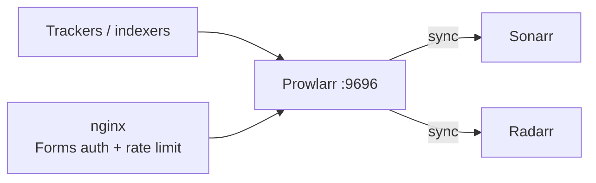

# Prowlarr

Indexer manager — holds tracker/indexer credentials in one place and syncs them out
to [Sonarr](../sonarr/README.md) and [Radarr](../radarr/README.md), instead of
configuring the same indexers twice. Reachable at `https://prowlarr.sillyash.com`
via the [nginx](../nginx/README.md) reverse proxy (nginx handles TLS; Prowlarr
itself listens on plain HTTP on `9696`).

## Architecture



## Install

No apt repo — installed via the official per-app `install.sh`, same pattern as
Sonarr/Radarr. Lives under `/opt/Prowlarr`, data/config under `/var/lib/prowlarr`.

```bash
curl -o /tmp/prowlarr-install.sh https://raw.githubusercontent.com/Prowlarr/Prowlarr/develop/distribution/debian/install.sh
sudo bash /tmp/prowlarr-install.sh
```

Runs as a dedicated `prowlarr` user, in the shared `media` group (gid 1001).

`/etc/systemd/system/prowlarr.service` (custom unit):

```ini
[Unit]
Description=Prowlarr Daemon
After=syslog.target network.target
[Service]
User=prowlarr
Group=media
UMask=0002
Type=simple
ExecStart=/opt/Prowlarr/Prowlarr -nobrowser -data=/var/lib/prowlarr/
TimeoutStopSec=20
KillMode=process
Restart=on-failure
[Install]
WantedBy=multi-user.target
```

## Config

- **Applications**: Sonarr and Radarr are registered as sync targets
  (`/api/v1/applications`, implementation `Sonarr`/`Radarr`) — any indexer added here
  automatically appears in both.
- **Authentication**: Forms auth, `authenticationRequired: enabled`. Username
  `ashley`; generated password in `/root/.arr-api-keys` on the Pi.

**Indexers**: NZBgeek (Usenet), synced out to Sonarr/Radarr automatically. Which
indexers to add is a personal choice tied to individual accounts, so it's left for
manual setup in the web UI (`Indexers → Add Indexer`) rather than scripted — this
list will grow over time as more get added.

## Useful commands

```bash
sudo systemctl restart prowlarr
systemctl status prowlarr
journalctl -u prowlarr -n 100 --no-pager
journalctl -u prowlarr -f

# API (X-Api-Key header, key in /root/.arr-api-keys)
curl -s http://localhost:9696/api/v1/indexer -H "X-Api-Key: $PROWLARR_KEY"       # list configured indexers
curl -s http://localhost:9696/api/v1/applications -H "X-Api-Key: $PROWLARR_KEY"  # Sonarr/Radarr sync targets
```
