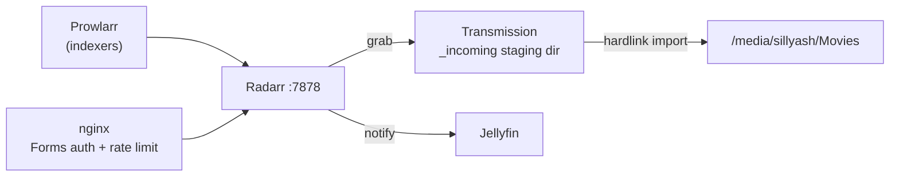

# Radarr

Movie PVR — same role as [Sonarr](../sonarr/README.md) but for films. Watches for
wanted movies across configured indexers (via [Prowlarr](../prowlarr/README.md)),
sends grabs to [Transmission](../transmission/README.md), imports the finished
download into the library, and tells [Jellyfin](../jellyfin/README.md) to refresh.
Reachable at `https://radarr.sillyash.com` via the [nginx](../nginx/README.md)
reverse proxy (nginx handles TLS; Radarr itself listens on plain HTTP on `7878`).

## Architecture



## Install

No apt repo — installed via the official per-app `install.sh`, same pattern as
Sonarr. Lives under `/opt/Radarr`, data/config under `/var/lib/radarr`.

```bash
curl -o /tmp/radarr-install.sh https://raw.githubusercontent.com/Radarr/Radarr/develop/distribution/debian/install.sh
sudo bash /tmp/radarr-install.sh
```

Runs as a dedicated `radarr` user, in the shared `media` group (gid 1001).

`/etc/systemd/system/radarr.service` (custom unit):

```ini
[Unit]
Description=Radarr Daemon
After=syslog.target network.target
[Service]
User=radarr
Group=media
UMask=0002
Type=simple
ExecStart=/opt/Radarr/Radarr -nobrowser -data=/var/lib/radarr/
TimeoutStopSec=20
KillMode=process
Restart=on-failure
[Install]
WantedBy=multi-user.target
```

## Config

- **Root folder**: `/media/sillyash/Movies`.
- **Download client** — Transmission: directory-based, pointed at
  `/media/sillyash/Movies/_incoming` — same physical disk (`sda1`) as the `Movies`
  root folder, so imports are same-filesystem hardlinks rather than cross-disk
  copies.
- **Download client** — NZBGet: enabled, routes Usenet-sourced grabs through Eweka —
  see [nzbget](../nzbget/README.md).
- **Authentication**: Forms auth, `authenticationRequired: enabled`. Username
  `ashley`; generated password in `/root/.arr-api-keys` on the Pi.
- **Notifications**: "Jellyfin" (`MediaBrowser`) connection, same as Sonarr —
  triggers a library refresh on download/upgrade/rename.
- **Indexers**: synced in from [Prowlarr](../prowlarr/README.md).

## Library import

Same manual-review approach as [Sonarr's](../sonarr/README.md#library-import):
existing movies under `/media/sillyash/Movies` get matched and confirmed per-item in
the web UI (`Movies → Add New → Import Existing Movies`), not auto-accepted via API.
Quality-upgrade pass over old files is deferred to a later, separate step.

## Useful commands

```bash
sudo systemctl restart radarr
systemctl status radarr
journalctl -u radarr -n 100 --no-pager
journalctl -u radarr -f

# API (X-Api-Key header, key in /root/.arr-api-keys)
curl -s http://localhost:7878/api/v3/system/status -H "X-Api-Key: $RADARR_KEY"
curl -s http://localhost:7878/api/v3/queue -H "X-Api-Key: $RADARR_KEY"
curl -s http://localhost:7878/api/v3/wanted/missing -H "X-Api-Key: $RADARR_KEY"
```
