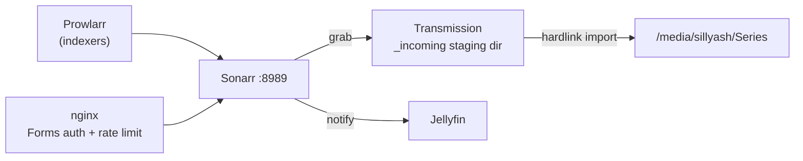

# Sonarr

TV series PVR — watches for wanted episodes across configured indexers (via
[Prowlarr](../prowlarr/README.md)), sends grabs to [Transmission](../transmission/README.md),
imports the finished download into the library, and tells [Jellyfin](../jellyfin/README.md)
to refresh. Reachable at `https://sonarr.sillyash.com` via the
[nginx](../nginx/README.md) reverse proxy (nginx handles TLS; Sonarr itself listens
on plain HTTP on `8989`).

## Architecture



## Install

No apt repo — installed via the official per-app `install.sh` (interactive by
default; run non-interactively with `-y`/env vars piped in). Lives under
`/opt/Sonarr`, data/config under `/var/lib/sonarr`.

```bash
curl -o /tmp/sonarr-install.sh https://raw.githubusercontent.com/Sonarr/Sonarr/develop/distribution/debian/install.sh
sudo bash /tmp/sonarr-install.sh
```

Runs as a dedicated `sonarr` user, in the shared `media` group (gid 1001) so it can
read/write across disks other services in that group also touch.

`/etc/systemd/system/sonarr.service` (custom unit, package doesn't ship one):

```ini
[Unit]
Description=Sonarr Daemon
After=syslog.target network.target
[Service]
User=sonarr
Group=media
UMask=0002
Type=simple
ExecStart=/opt/Sonarr/Sonarr -nobrowser -data=/var/lib/sonarr/
TimeoutStopSec=20
KillMode=process
Restart=on-failure
[Install]
WantedBy=multi-user.target
```

## Config

- **Root folder**: `/media/sillyash/Series` (existing library lives here directly;
  Sonarr sees the pre-existing show folders as "unmapped" until matched — see
  [Library import](#library-import) below).
- **Download client** — Transmission: directory-based (not category-based), pointed
  at `/media/sillyash/Series/_incoming`. This staging folder lives on the *same
  physical disk* (`sdb1`) as the `Series` root folder, so Sonarr's import is a
  same-filesystem hardlink rather than a slow cross-disk copy (Transmission's own
  default download dir is on the root filesystem, a different disk).
- **Download client** — NZBGet: enabled, routes Usenet-sourced grabs (from the
  NZBgeek indexer via Prowlarr) through Eweka — see [nzbget](../nzbget/README.md).
- **Authentication**: Forms auth (`authenticationRequired: enabled` — always
  required, not `disabledForLocalAddresses`, since nginx proxies public traffic to
  localhost and that distinction would otherwise bypass auth for every proxied
  request). Username `ashley`; password generated at setup time, stored in
  `/root/.arr-api-keys` on the Pi (root-only, mode `600`) — not committed anywhere.
- **Notifications**: a "Jellyfin" (`MediaBrowser`) connection triggers on
  download/upgrade/rename, refreshing the Jellyfin library automatically after an
  import — no manual "scan library" step needed after a new episode lands.
- **Indexers**: synced in from [Prowlarr](../prowlarr/README.md) automatically — not
  configured directly in Sonarr.

## Library import

Existing series under `/media/sillyash/Series` are being brought under Sonarr's
management rather than left untouched or replaced. This is a **manual-review**
process by design — Sonarr proposes a TVDB match per folder and it gets confirmed
per-item in the web UI (`Series → Add New → Import Existing Series`) rather than
blindly auto-accepted via the API, so a wrong match doesn't silently rename/move
files. A quality-upgrade pass over older/poor-quality files is a deliberately
separate, later step — not part of this import.

## Useful commands

```bash
sudo systemctl restart sonarr        # apply a config change
systemctl status sonarr              # running?
journalctl -u sonarr -n 100 --no-pager
journalctl -u sonarr -f              # follow logs live

# API (X-Api-Key header, key in /root/.arr-api-keys)
curl -s http://localhost:8989/api/v3/system/status -H "X-Api-Key: $SONARR_KEY"
curl -s http://localhost:8989/api/v3/queue -H "X-Api-Key: $SONARR_KEY"          # active downloads
curl -s http://localhost:8989/api/v3/wanted/missing -H "X-Api-Key: $SONARR_KEY" # missing episodes
```
