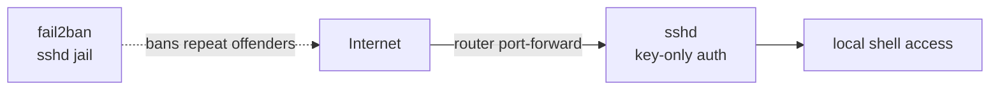

# SSH

Remote shell access to the box, port `22`, reachable directly (not proxied through
nginx — nginx only terminates HTTP/HTTPS, and SSH is a raw TCP protocol). The
`ssh.sillyash.com` DNS record kept up to date by [ddclient](../ddclient/README.md)
just points at the box's public IP; reaching it depends on the home router
forwarding port 22 to this machine.

## Architecture



## Config

Stock Debian `openssh-server` config (`/etc/ssh/sshd_config`, unmodified) plus one
local override in `/etc/ssh/sshd_config.d/`:
[`99-hardening.conf`](sshd_config.d/99-hardening.conf):

```
PasswordAuthentication no
KbdInteractiveAuthentication no
PermitRootLogin no
```

Password/keyboard-interactive login is disabled — key-only auth. **Before deploying
this on a fresh box**, make sure a working key is already in
`~/.ssh/authorized_keys` (mode `600`, `~/.ssh` mode `700`) and verified from your
actual client — disabling password auth without one locks you out entirely, with no
fallback but console/physical access.

Other stock settings still in effect: `UsePAM yes`, `X11Forwarding yes`,
`PrintMotd no`, `AcceptEnv LANG LC_*`, `Subsystem sftp /usr/lib/openssh/sftp-server`.

## Brute-force protection

[fail2ban](../fail2ban/README.md)'s `sshd` jail bans an IP for 1h after 5 failed
attempts within 10 minutes. There's a steady trickle of bots trying `root` logins on
port 22 — `PermitRootLogin no` + fail2ban keeps that from going anywhere.

## Useful commands

```bash
systemctl status ssh                        # is sshd running
systemctl reload ssh                        # apply sshd_config changes (safer than restart — doesn't drop existing sessions)
sshd -t                                     # validate config before reloading
sshd -T | grep -i passwordauthentication    # check an effective setting
journalctl -u ssh -n 50 --no-pager          # recent sshd log
fail2ban-client status sshd                 # jail status / currently banned IPs
fail2ban-client set sshd unbanip <IP>       # manually unban an IP
```
