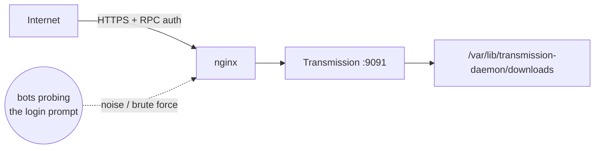

# Transmission

BitTorrent client, web UI reachable at `https://transmission.sillyash.com` via the
[nginx](../nginx/README.md) reverse proxy (nginx handles TLS; the daemon itself
listens on plain HTTP on `9091`).

## Architecture



Kept intentionally public so torrents can be added remotely — but the login prompt
gets probed by bots constantly. Mitigation is tracked as an open proposal rather than
fixed silently here.

**Related**: [PR #2](https://github.com/sillyash/homelab/pull/2) proposes nginx rate
limiting + fail2ban for this.

## Install

```bash
apt install transmission-daemon
```

Runs as the dedicated `debian-transmission` system user. Package-stock systemd unit,
no local overrides.

```bash
systemctl enable --now transmission-daemon
```

## Config

`/etc/transmission-daemon/settings.json` (mode `600`, owned by
`debian-transmission` — not committed, contains the RPC password hash). Relevant
non-secret settings currently in effect:

| Key | Value | Note |
|---|---|---|
| `download-dir` | `/var/lib/transmission-daemon/downloads` | stock default |
| `rpc-port` | `9091` | proxied by nginx |
| `rpc-bind-address` | `0.0.0.0` | exposed on all interfaces, but... |
| `rpc-authentication-required` | `true` | ...login is required, and nginx puts TLS in front of it |
| `rpc-whitelist-enabled` | `false` | IP whitelist off — relying on auth + TLS instead |

Set/change the RPC username & password:

```bash
systemctl stop transmission-daemon
# edit rpc-username / rpc-password in settings.json, or use transmission-remote
systemctl start transmission-daemon
```
