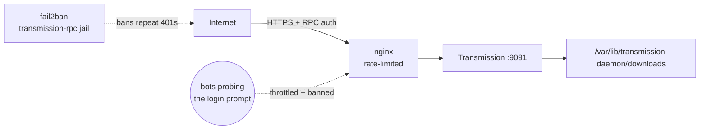

# Transmission

BitTorrent client, web UI reachable at `https://transmission.sillyash.com` via the
[nginx](../nginx/README.md) reverse proxy (nginx handles TLS; the daemon itself
listens on plain HTTP on `9091`).

## Architecture



Kept intentionally public so torrents can be added remotely. The login prompt gets
probed by bots constantly, so it's mitigated rather than moved behind a VPN:

- **nginx rate limiting** ([`conf.d/rate-limit.conf`](../nginx/conf.d/rate-limit.conf),
  applied in the `transmission.sillyash.com` server block in
  [`sites-available/jellyfin`](../nginx/sites-available/jellyfin)): `5r/m` per IP with
  a burst of 5, plus a cap of 5 concurrent connections per IP. Throttles bots before
  they even reach Transmission; a human occasionally logging in to add a torrent is
  unaffected.
- **[fail2ban](../fail2ban/README.md)'s `transmission-rpc` jail**: bans an IP for 2h
  after 8 failed (HTTP 401) login attempts within 10 minutes, parsed from nginx's
  access log.

## Install

```bash
apt install transmission-daemon
```

Runs as the dedicated `debian-transmission` system user. Package-stock systemd unit,
no local overrides.

```bash
systemctl enable --now transmission-daemon
```

## Config

`/etc/transmission-daemon/settings.json` (mode `600`, owned by
`debian-transmission` — not committed, contains the RPC password hash). Relevant
non-secret settings currently in effect:

| Key | Value | Note |
|---|---|---|
| `download-dir` | `/var/lib/transmission-daemon/downloads` | stock default |
| `rpc-port` | `9091` | proxied by nginx |
| `rpc-bind-address` | `0.0.0.0` | exposed on all interfaces, but... |
| `rpc-authentication-required` | `true` | ...login is required, and nginx puts TLS in front of it |
| `rpc-whitelist-enabled` | `false` | IP whitelist off — relying on auth + TLS instead |

Set/change the RPC username & password:

```bash
systemctl stop transmission-daemon
# edit rpc-username / rpc-password in settings.json, or use transmission-remote
systemctl start transmission-daemon
```
